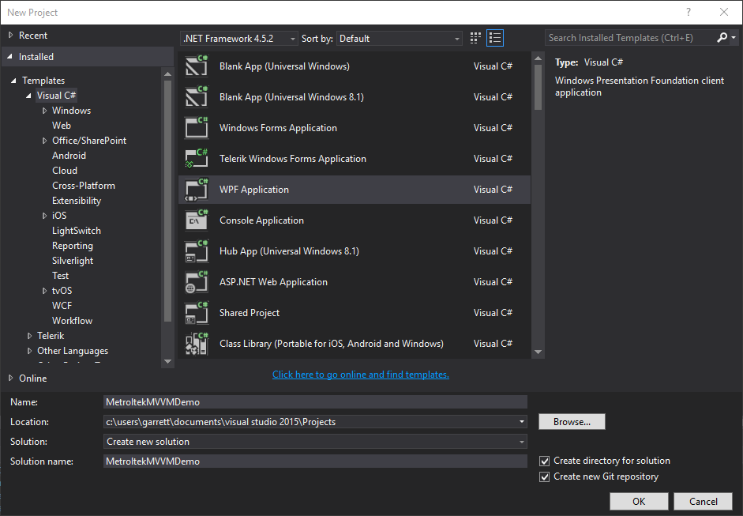
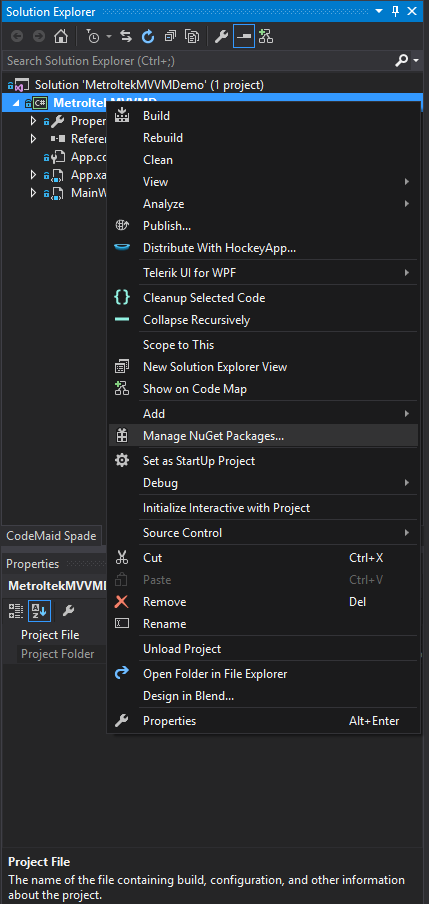
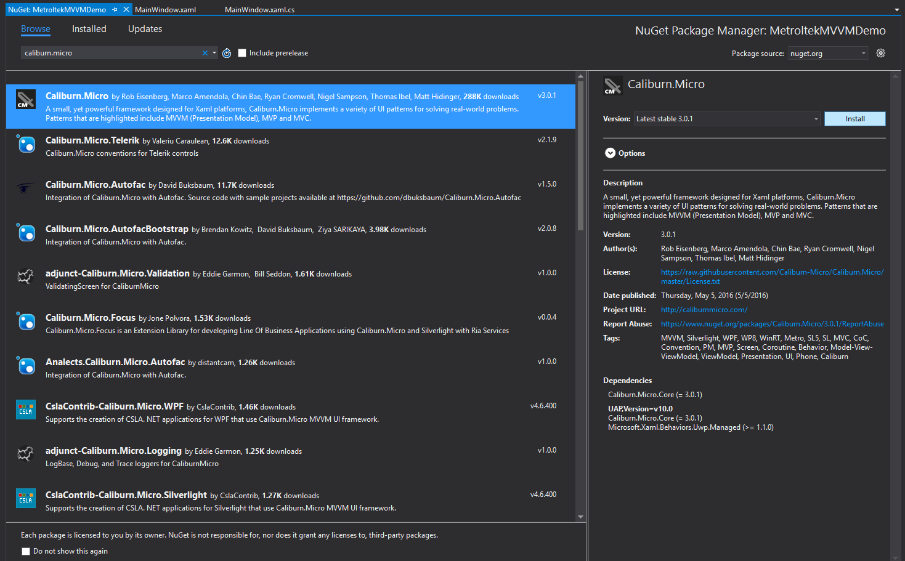
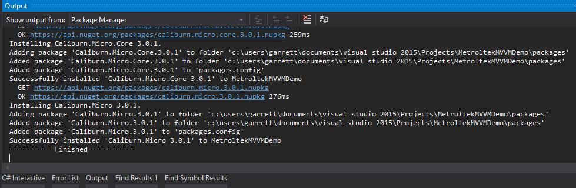
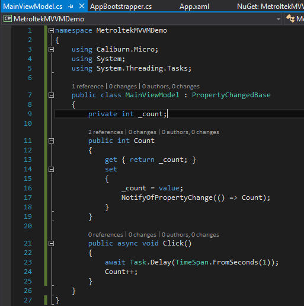
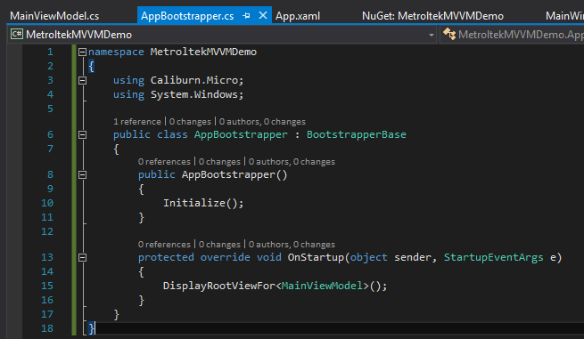
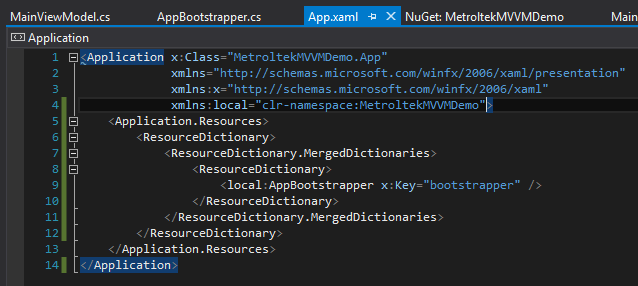
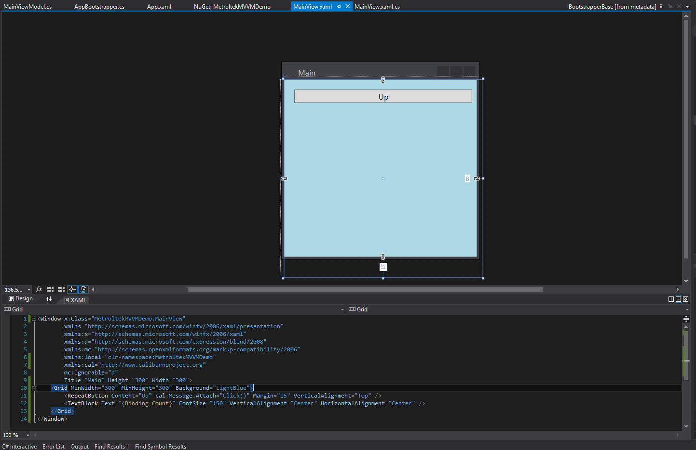
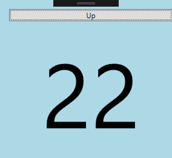

# Tutorial

1. Create wpf project

  

2. Manage nuget packages

  

3. Search Caliburn Micro and install

  

4. Wait for Finished

  

5. Create first viewmodel. Right now we just have a count that takes 1000 milliseconds to increment (but not lock the ui for that time). Notice the NotifyPropertyChanged that let's the ui know when to refresh.

  

6. (one time setup) Create a bootstrapper so Caliburn Micro can take over.

  

7. (one time setup) Put that bootstrapper in the root application resources so it can take over.

  

8. Create a UI that will independently load properties and methods from the ViewModel

  

9. Run the project and notice you can click the button infinitely without locking the ui, even while waiting for the previous click.

  
